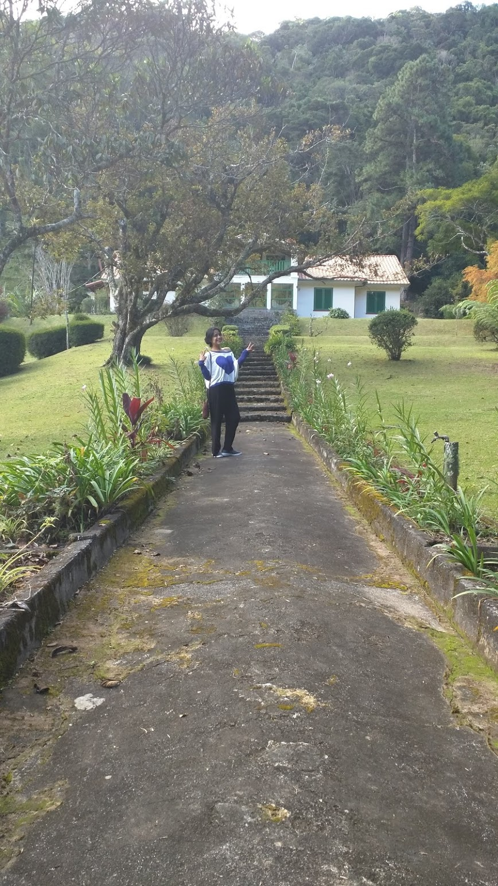

Emails: pamela@dme.ufrj.br

## Institutional address:

### SAGE/COPPE: http://www.sage.coppe.ufrj.br/

Laboratório de Avaliação e Monitoramento da Biodiversidade,  
Laboratório de Sistemas Avançados de Gestão,  
Centro de Gestão Tecnológica - CT2,  
Avenida Moniz Aragão, no.360 - Bloco 2, Ilha do Fundão - Cidade Universitária,   
Rio de Janeiro, RJ, Brasil  
CEP: 21941594 

### IM dme UFRJ:
Instituto de Matemática  
Departmento de métodos estatísticos  
Avenida Athos da Silveira Ramos, 149 Bloco C, Ilha do Fundão - Cidade Universitária,   
Rio de Janeiro, RJ, Brasil  
CEP: 21941972 
