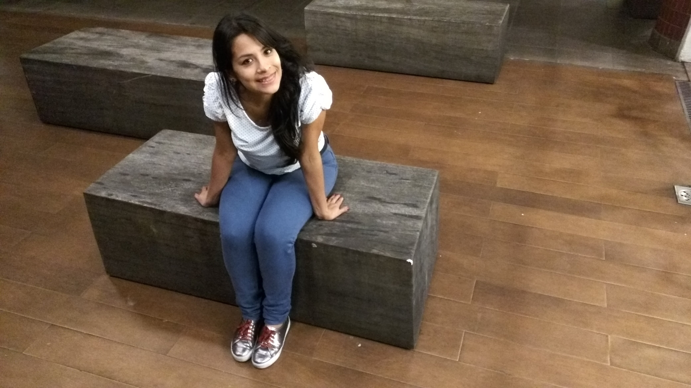

<link rel="stylesheet" href="styles.css" type="text/css">




- Posdoctoral researcher at [SAGE](http://www.sage.coppe.ufrj.br)/[Abrolhos](http://abrolhos.org), Brazil.

## CV and publications:

- [Personal CV](CV/cv-Pamela.pdf) 
- [Lattes CV](http://lattes.cnpq.br/3521875663611776)
- [Google Scholar](https://scholar.google.com.au/citations?user=La3oKqMAAAAJ&hl=pt-BR)
- Orcid: [0000-0002-2667-8755](https://orcid.org/0000-0002-2667-8755)
- [Publication page](publications.html)

### Research 

- (Statistical Ecology). Program Ecology Conference - UFRJ on December 2 2020.[(Link)](pUFRJ/)

- (Statistical Ecology). virtual International Statistical Ecology Conference - Sydney Austrália on June 24 2020.[(Link)](vISEC/)

- (COVID-19) Maps: covid-19 pandemic vulnerability index . [(Link)](https://acaocovid19-homolog.web.app/statistics)

- (Perú COVID-19) Confirmed cases in Perú by distrits. [(Link)](https://pchiroque.shinyapps.io/perucovid19/)

- (Projects) Marine Ecology modeling

- (Projects) Arboviral (Arthropod-borne Viral) Diseases

- Joint modeling of longitudinal markers and survival data: an approach via dynamic
hierarchical models (Thesis) ([Thesis](http://www.pg.im.ufrj.br/teses/Estatistica/Doutorado/040.pdf))

- 33 Foro Nacional de Estadística (33FNE) y XIII Congreso Latinoamericano de sociedades de estadística (13 CLATSE) - Guadalajara Mexico [CLATSE 2018](Clatse/Clatse2018.pdf) 

- V Congreso Latinoamericano de Estatística Bayesiana - Guanajuato Mexico [Cobal 2017](Cobal/Joint.pdf) 

- IV Congreso Latinoamericano de Estatística Bayesiana - Medellin Colombia [Cobal 2015](Cobal/Atuaria.pdf) 


Last update:
```{r, echo=F}
date()
```
